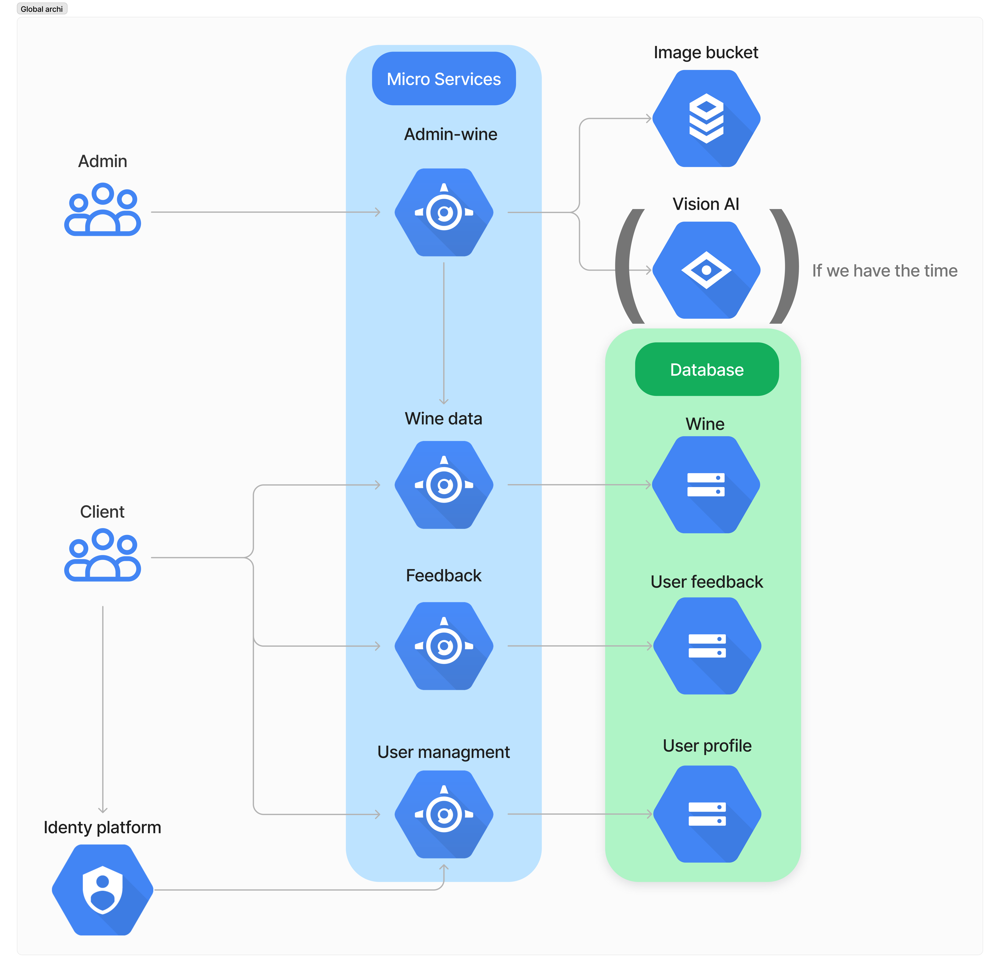

# Backend guide for Vintellect

Welcome to the Backend Guide for Vintellect! 
This guide serves as a central resource for setting up and managing the backend components of your Vintellect projects.

## Link to specific guide :

💾 [Cloud Spanner](./Cloud_spanner_guide.md) 💾

🖥️ [Microservices](./Microserivces_guide.md) 🖥️

🪣 [Set up public buckets](https://cloud.google.com/storage/docs/creating-buckets) 🪣

🔐 [Set up email/passw login](https://cloud.google.com/identity-platform/docs/sign-in-user-email) 🔐

## Architecture Diagram

Here is a scheme to show the interaction between microservices and users:

